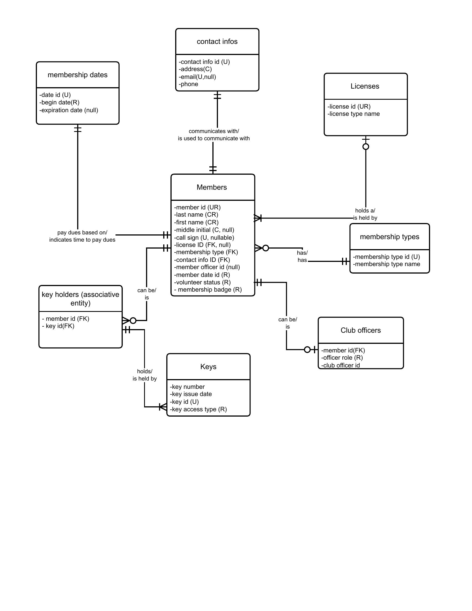
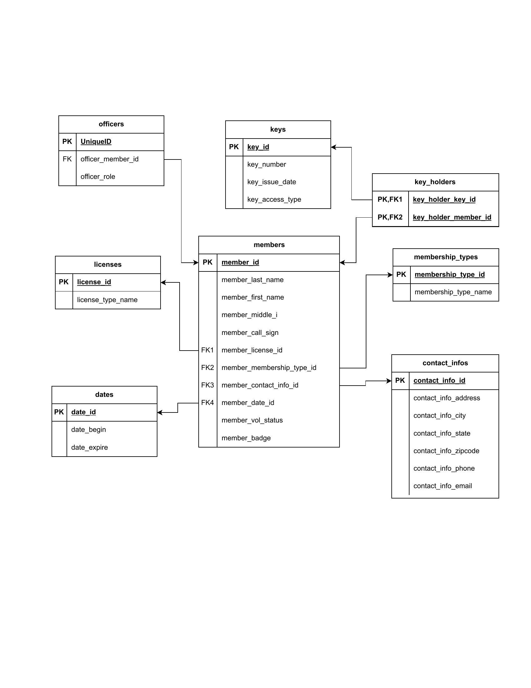
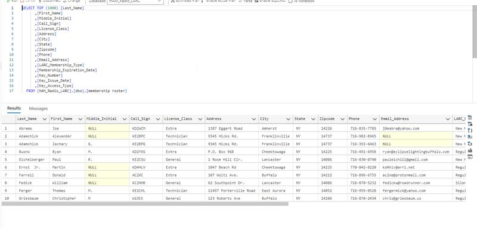

# LARC Membership Database (SQL Server)

**Course:** IST-659 — Database Concepts and Administration  
**Stack:** T-SQL · SQL Server · 3NF · ERD · Triggers · Views · Indexes

## Overview

Relational database designed for the Livingston Amateur Radio Club (LARC) to replace a flat-file spreadsheet system. The schema normalizes 150+ member records into a fully 3NF-compliant, 9-table SQL Server database with a complete data pipeline migrating from a raw CSV import.

## Schema (9 Tables)

| Table | Purpose |
|---|---|
| `Members` | Core member entity; FK hub for all lookup tables |
| `Licenses` | FCC license class lookup (Technician / General / Extra) |
| `Membership_Types` | Member category lookup (Active / New / Silent Key) |
| `Membership_Dates` | Begin and expiration date tracking per member |
| `Contact_Infos` | Normalized address, phone, and email records |
| `Keys` | Physical facility keys issued by the club |
| `Key_Holders` | Bridge table resolving Members ↔ Keys (M:M) |
| `Club_Officers` | Officer roles tied to member records |
| `Membership_Dues` | Payment ledger; drives expiration via trigger |

## Features Demonstrated

- **Normalization:** 3NF design extracted from a flat CSV with redundant string columns
- **Data Pipeline:** Staged import → deduplication → FK-resolved INSERT across 9 tables
- **Trigger:** `trg_UpdateMembershipExpiration` auto-advances membership expiration to 12/31 on dues payment
- **Views:** `vw_Club_Officers`, `vw_Member_Directory`, `vw_Key_Holders`
- **Indexes:** Nonclustered indexes on badge tier, volunteer status, license type, and key bridge table
- **Analytical Queries:** Renewal reminders (30-day window), dues ledger by month, badge distribution, license class counts
- **Safe Teardown:** Idempotent `IF EXISTS` DROP script in correct FK dependency order

## How to Run

1. Open SQL Server Management Studio (SSMS)
2. Import `membership_roster.csv` via the Import Wizard → name the table `Membership Roster`
3. Open `HAM_Radio_LARC_Portfolio.sql` and run the full script
4. To tear down, execute Section 10 (DOWN script) at the bottom of the file

## Project Context

Built as part of a graduate-level database design course. Source data was a real club membership roster. Officer roles were sourced from club records and merged during the staging phase.

## Design Artifacts

### Conceptual ERD
Shows entities, attributes, and relationships before implementation.

### Logical Data Model
Fully attributed 3NF model with PKs, FKs, and column names finalized.

### Live Query Results (SSMS)
Members table populated from the CSV pipeline, queried in SQL Server Management Studio.

